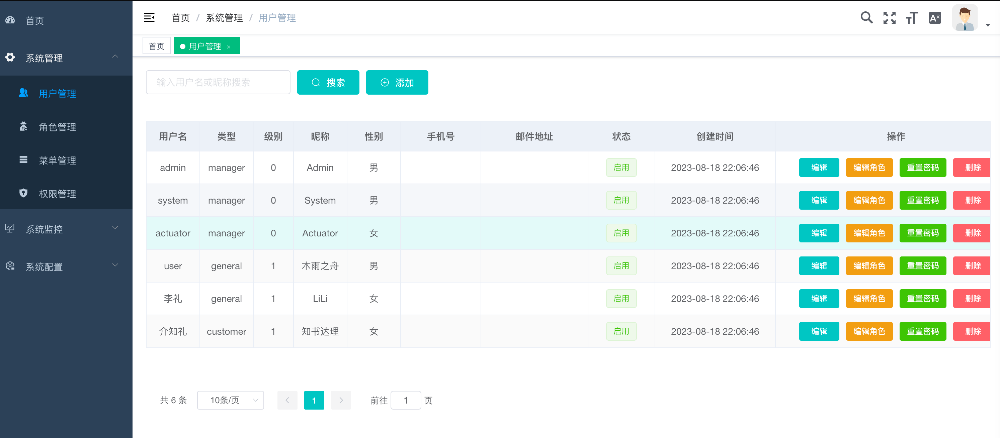

# bamboo-admin-vue
BAMBOO后台管理系统--前端项目

> 这是一个极简的 vue admin 管理后台的前端项目。它基于优秀的开源模版
[vue-admin-template](https://github.com/PanJiaChen/vue-admin-template)进行定制化开发。

目前版本为 `v4.0+` 基于 `vue-cli` 进行构建。

## 相关项目

- [business-admin](https://github.com/jiefangen/bamboo/tree/master/bamboo-business/business-admin) 与其对接的后端服务器项目

## 项目构建

```bash
# 克隆项目
git clone https://github.com/jiefangen/bamboo-admin-vue.git

# 进入项目目录
cd bamboo-vue

# 安装依赖
npm install

# 建议不要直接使用 cnpm 安装以来，会有各种诡异的 bug。可以通过如下操作解决 npm 下载速度慢的问题
npm install --registry=https://registry.npm.taobao.org

# 启动服务
npm run admin-dev
```

浏览器访问 [http://localhost:9100](http://localhost:9100)
演示地址：http://47.116.33.28/#/dashboard

## 发布

```bash
# 构建测试环境
npm run build:stage

# 构建生产环境
npm run build:prod
```

## 其它

```bash
# 预览发布环境效果
npm run preview

# 预览发布环境效果 + 静态资源分析
npm run preview -- --report

# 代码格式检查
npm run lint

# 代码格式检查并自动修复
npm run lint -- --fix
```

## 演示图例

- 登录模块
  
- 我的模块--个人中心、布局设置、项目地址、退出登录
  
- 我的管理--个人中心
  
- 我的管理--布局设置
  
- 系统管理--用户管理（编辑、授权、密码、删除）
  
- 系统管理--角色管理（菜单编辑、权限查看、删除）
  
- 系统管理--菜单管理（编辑、删除）
  
- 系统管理--权限管理
  
- 监控管理--在线用户、操作日志、API文档、Druid监控
  
  
- 系统配置--参数设置（编辑、删除）
  
- 系统配置--字典管理（编辑、删除）
  
  
## License

[Apache 2.0](https://github.com/jiefangen/frontend-vue/blob/main/admin-vue/LICENSE) license.

Copyright (c) 2023-present JieFangen
